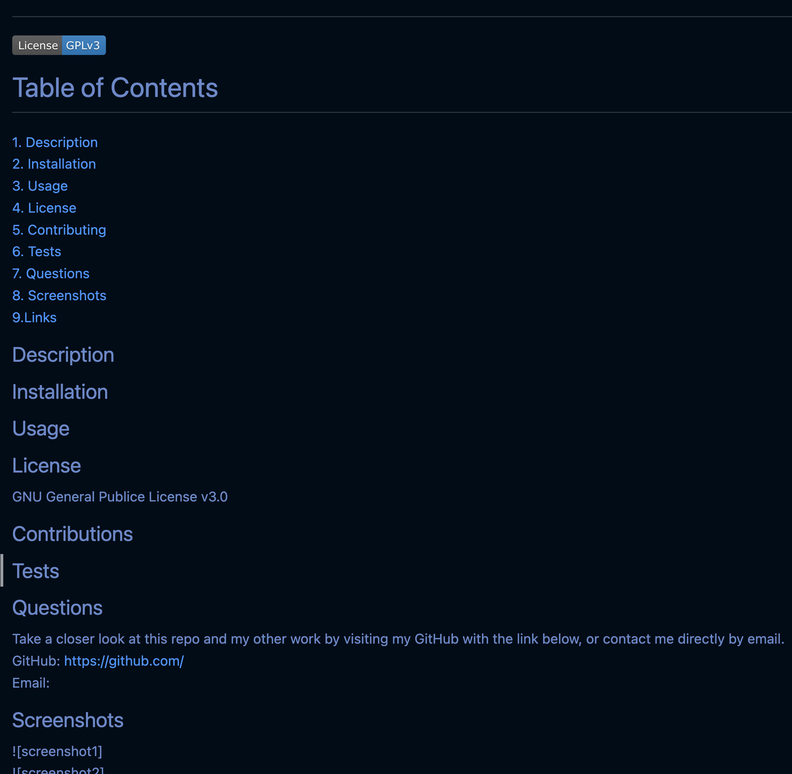
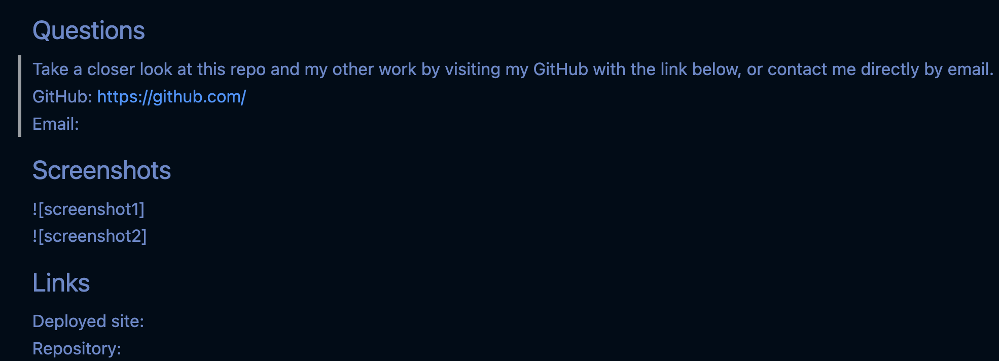

# README File Generator  
  
  
 # Table of Contents  
   
[1. Description](##Description)  
[2. Installation](##Installation)  
[3. Usage](##Usage)  
[4. License](##License)  
[5. Contributing](##Contributing)  
[6. Tests](##Tests)  
[7. Questions](##Questions)  
[8. Screenshots](##Screenshots)  
[9.Links](##Links)  
## Description  
This script is capable of creating a ReadMe file with simple inputs from the user that are then imported into a professional README file templlate.  
  
## Installation  
Node: Version 16 or later, Inquirer(npm): Version 8.2.4, File Storage library that gets   
  
## Usage  
When creating a file or repo to be published to the public, ReadMe files are an important form of communication between the creator of the file and the user accessing it.    
  
## License  
MIT License  
  
## Contributions  
Yes. Open to contributors who could made the media input more modifiable and without limit of amount.   
   
## Tests   
Try running in node using Visual Studio.   
   
## Questions  
Take a closer look at this repo and my other work by visiting my GitHub with the link below, or contact me directly by email.  
GitHub: https://github.com/ShannyaN   
Email: niveyro101@gmail.com  
## Screenshots  
  
  
## Links  
Deployed site: N/A  
Repository:  https://github.com/ShannyaN/seven-ReadMeGen